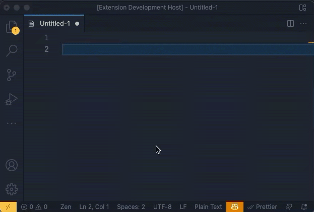

# Snippet Sync for VS Code

If you need to share snippet files and keep them updated when they change,
Snippet Sync is for you!

Snippet Sync allows your team to keep any GitHub-hosted snippet file up to date
across repositories.
Snippet Sync supports both public and private repositories.

## Features

- Supports any repo hosted at github.com.
- Sign in with your GitHub account to access snippets in private repos.
- Sync automatically every 10 minutes, or sync manually whenever you want.
- Keyboard shortcut for syncing (**alt + shift + s**).

## Requirements

- Snippet files must be hosted at github.com.
  Self-hosted repos not currently supported.
- If a snippet file is in a private repo, you must sign in to GitHub
  by running **Snippet Sync: Sign In to GitHub** from the Command Palette.

## Extension Settings

This extension contributes these settings:

- `snippetSync.snippetFiles`: List of github-hosted snippet files.
  Must be the full path to the GitHub file view
  (**not** the raw content).

## Known Issues

- Snippet files aren't currently validated.
  If the file exists, it's synced.
- Only GitHub-hosted snippets are supported.
  Self-hosted git repos are not supported.

## Release Notes

### NEXT: 1.0.2

- Add option to automatically sync snippets every 10 minutes.
  This option is enabled by default.
  To disable, set **Auto Sync Snippet Files** to false.
  ([#17](https://github.com/imnotashrimp/snippet-sync-vscode/pull/17))
- Add **alt + shift + s** keyboard shortcut for **Insert Snippet".
  ([#19](https://github.com/imnotashrimp/snippet-sync-vscode/pull/19))

### 1.0.1

Update package.json for a better Marketplace listing.

### 1.0.0

Initial release 🚀🎉
